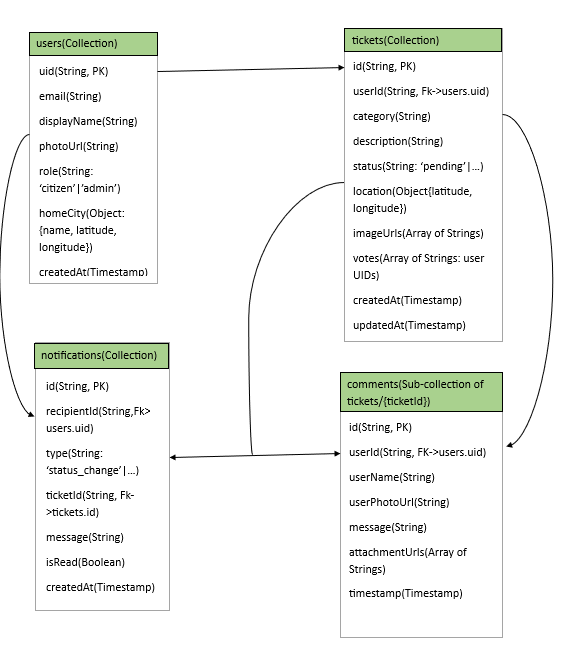

# CivicAlert

**Smart City Platform for Urban Incident Management**

CivicAlert is a web-based Smart City solution that bridges the gap between citizens and local administration. The platform enables citizens to report urban issues geospatially, engage with their community through voting and comments, and receive real-time notifications about issue resolutions.


## Features

- **Real-Time Notifications** - Automatic alerts when ticket statuses change or new community activity occurs
- **Geospatial Ticketing** - Report incidents displayed on an interactive map powered by ArcGIS Maps SDK
- **Community Voting** - Upvote existing reports to help prioritize critical issues
- **User Profiles** - Customizable avatars and city-based personalization
- **Heatmap Analysis** - Visual spatial analysis for identifying problem hotspots
- **Comments & Discussions** - Community engagement on tickets with photo attachments
- **Admin Dashboard** - Comprehensive moderation panel for ticket management

## Technology Stack



**Frontend:** Next.js 16 (React 19), TypeScript, Tailwind CSS, Radix UI, Lucide React

**Backend:** Google Firebase (Firestore, Authentication, Storage, Cloud Functions)

**Geospatial:** ArcGIS Maps SDK for JavaScript (v4.34.8), ArcGIS Online Basemaps

## Getting Started

### Prerequisites

- Node.js 20.x or later
- Firebase account
- ArcGIS Developer account

### Installation

1. Clone and install dependencies

   ```bash
   git clone <repository-url>
   cd CivicAlert
   npm install
   ```

2. Configure environment variables (`.env.local`)

   ```env
   NEXT_PUBLIC_FIREBASE_API_KEY=your_api_key
   NEXT_PUBLIC_FIREBASE_AUTH_DOMAIN=your_auth_domain
   NEXT_PUBLIC_FIREBASE_PROJECT_ID=your_project_id
   NEXT_PUBLIC_FIREBASE_STORAGE_BUCKET=your_storage_bucket
   NEXT_PUBLIC_FIREBASE_MESSAGING_SENDER_ID=your_sender_id
   NEXT_PUBLIC_FIREBASE_APP_ID=your_app_id
   NEXT_PUBLIC_ARCGIS_API_KEY=your_arcgis_api_key
   ```

3. Run the development server
   ```bash
   npm run dev
   ```

Open [http://localhost:3000](http://localhost:3000) in your browser.

## Screenshots


