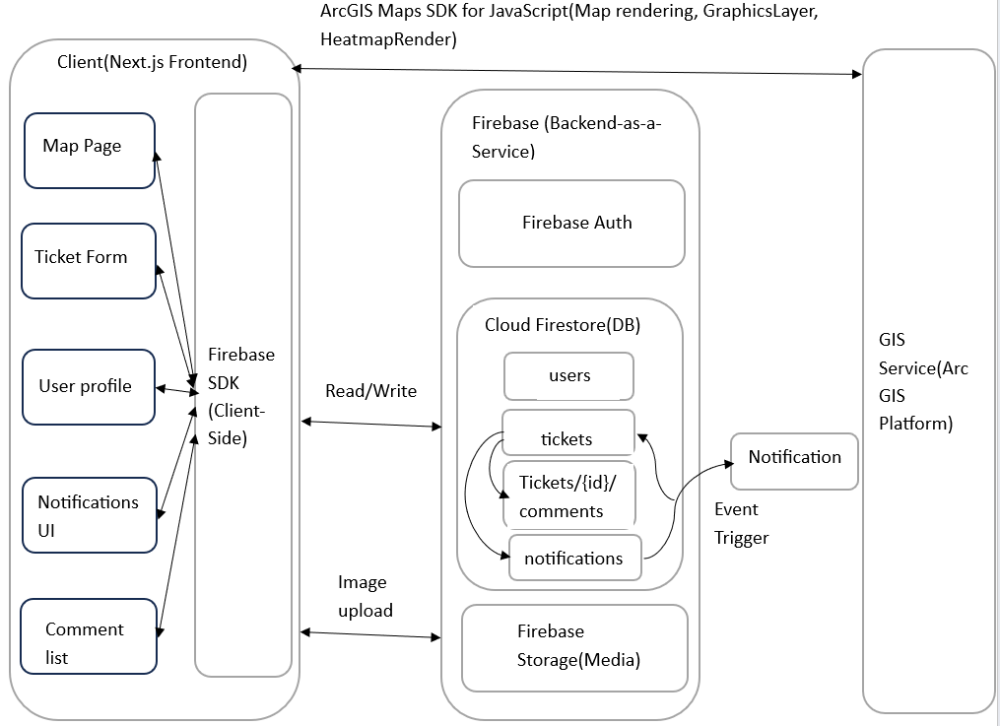
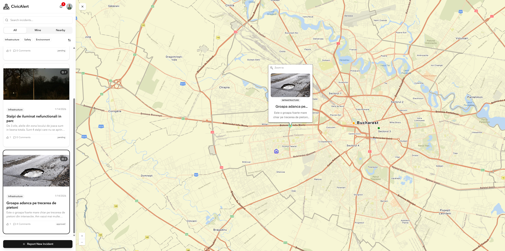
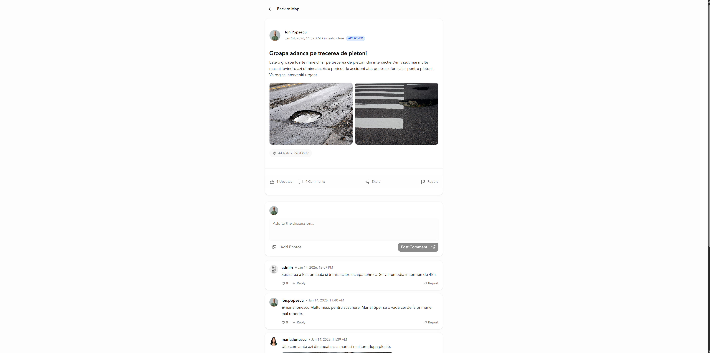
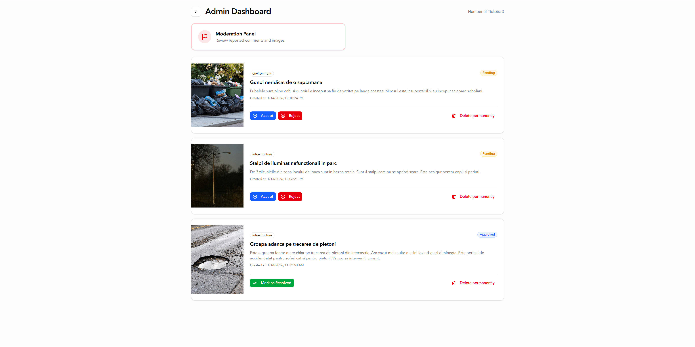

# CivicAlert

## Platforma Smart City pentru Managementul Sesizarilor Urbane

**Echipa GoSky**
Alexandru Grecu
Andrei-Alexandru Girleanu

---

# Introducere si Obiective

**Context:** Digitalizarea interactiunii cetatean-autoritate intr-un **Smart City**.

**Problema:** Lipsa transparentei in rezolvarea incidentelor si dificultatea de a raporta locatia exacta a problemelor.

**Obiective:**

1. **Ticketing Geospatial:** Raportare direct pe harta.
2. **Implicare Comunitara:** Sistem de voturi si comentarii.
3. **Notificari:** Alertare in timp real.
4. **Analiza:** Vizualizare Heatmap de catre autoritati pentru zone cu probleme.

---

# Solutia Propusa: Forum Civic pe Harta

O aplicatie web care combina functionalitatea unui **forum de discutii** cu precizia **hartilor ArcGIS**.

**Cum functioneaza?**

- **Forum Vizual:** Fiecare "topic" de discutie este un punct pe harta (o groapa, un bec ars).
- **Interatiune:** Utilizatorii pot discuta direct pe sesizare (comentarii), pot incarca poze si pot vota urgentele (Upvote).
- **Moderare:** Administratia are un dashboard dedicat pentru aprobarea, vizualizarea si rezolvarea sesizarilor.

---

# Schema bloc

---

# Scenarii de utilizare

---

# Tehnologii

| Categorie    | Tehnologii                                                  |
| :----------- | :---------------------------------------------------------- |
| **Frontend** | **Next.js**, **React**, TypeScript, Tailwind CSS, shadcn/ui |
| **Backend**  | **Google Firebase** (Firestore, Auth, Storage)              |
| **Harti**    | **ArcGIS Maps SDK**                                         |

---

# Echipa si Contributii

**Alexandru Grecu**

- Setup Proiect, Configurare Firebase & Auth, Profil Utilizator.
- Implementare Notificari & vizualizare Heatmap.
- Design Pagina Principala (Dots, Home point) & Formular Creare Tichet.
- Pagina de Forum (Ticket preview).

**Andrei-Alexandru Girleanu**

- Initializare Harta & Selectie Coordonate (Click pe harta).
- Functionalitati Sociale: Sistem de Comentarii, Like/Dislike, Upload imagini in comentarii.
- Dashboard Administrator.
- Afisare si actualizare lista tichete.

---

# Roadmap (Parcurs)

1. **Setup & Core:** Configurare Next.js, Firebase, Harta de baza.
2. **Functionalitati Cheie:** Creare tichete, pozitionare exacta pe harta.
3. **Social & Admin:** Implementare comentarii, voturi, dashboard admin.
4. **Rafinare:** Notificari, Heatmap, UI Design.

---

# Rezultate

---

# Rezultate: Detalii Tichet

---

# Rezultate: Dashboard Admin

---

# Concluzii & Perspective

- **CivicAlert** modernizeaza sesizarile urbane printr-o abordare vizuala.
- Comunitatea este implicata activ prin sistemul de tip "Forum".
- **ArcGIS** ofera precizie in localizarea problemelor.

**Perspective Viitoare:**

- **Aplicatie Mobila:** Versiuni native pentru iOS si Android.
- **Analiza AI:** Clasificarea automata a sesizarilor prin imagini.
- **Integrare:** Comunicare directa cu sistemele autoritatilor.
